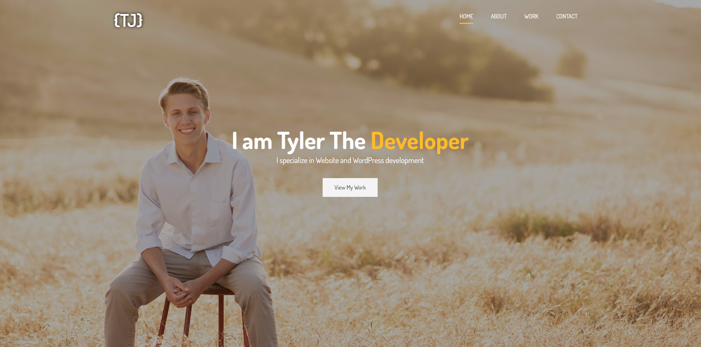

# Portfolio Website

A responsive portfolio website created over two years ago to showcase my early web development skills and design capabilities. This project demonstrates foundational knowledge in web development with a focus on creating a clean and structured layout. **Note**: This project has not been updated since its creation.



---

## 🚀 Features
- **Responsive Design**: Optimized for various screen sizes, ensuring accessibility across devices.
- **Project Showcase**: Highlights key projects and skills.
- **Contact Section**: Simple form and contact details for easy communication.
- **Custom Styling**: Built with SCSS to manage styles more effectively.

---

## 🛠️ Tech Stack
- **Front-End**: HTML, CSS, SCSS, JavaScript

---

## 📂 Project Structure
```
root
├── public/
├── src/
│   ├── styles/
│   └── index.html
├── .gitignore
├── package.json
└── README.md
```

---

## 🚀 Getting Started

### Prerequisites
Ensure you have the following installed:
- Any modern web browser

### Installation
1. Clone the repository:
   ```bash
   git clone https://github.com/TylerJarvis3256/portfolio-website.git
   cd portfolio-website
   ```

2. Open the `index.html` file in your browser to view the site locally.

---

## 🌟 Demo
[Demo Link](https://tylerjarvis-portfolio-demo.netlify.app/)

---

## 📝 To-Do
- [ ] Update content to reflect current skills and projects.
- [ ] Redesign for modern web development standards.
- [ ] Integrate React.js or other modern frameworks for scalability.

---

## 💬 Contact
- **Author**: Tyler Jarvis
- **Email**: tylerjarvis3256@gmail.com
- **LinkedIn**: [Tyler Jarvis LinkedIn](https://linkedin.com/in/tyler-jarvis-b8a72023b)
- **GitHub**: [Tyler Jarvis GitHub](https://github.com/TylerJarvis3256)
